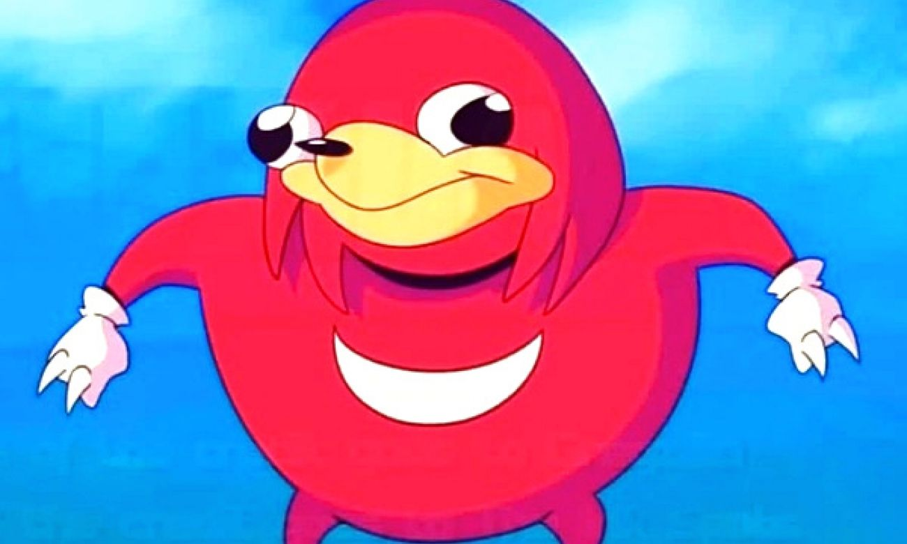

  

My first project on display is called Knuckles Meme. Back in early 2018, I was taked in creating my first ever video game on Java. The task itself was very difficult as I had little-to-no knowledge on coding games. However, with the help of practice and the EZ directory, the project I envisioned to complete was finished. 

The player must physically press on the arrow keys with their mouse (or just the arrow keys on their keyboard) in order to move knuckles in any direction they please. The goal of the game was move knuckles towards the queen in order for him to smell her. There is a score count and a time limit of 60 seconds. The counter when up if knuckles were to have collided with the queen. During the creation of this project, I learned about user input (mouse or keys) and how they can be used to translate to player movement. 

Created Spring of 2018, ICS 111.

You can view the game on my [YouTube Channel](https://www.youtube.com/watch?v=Qnfj9sjCO0o).
