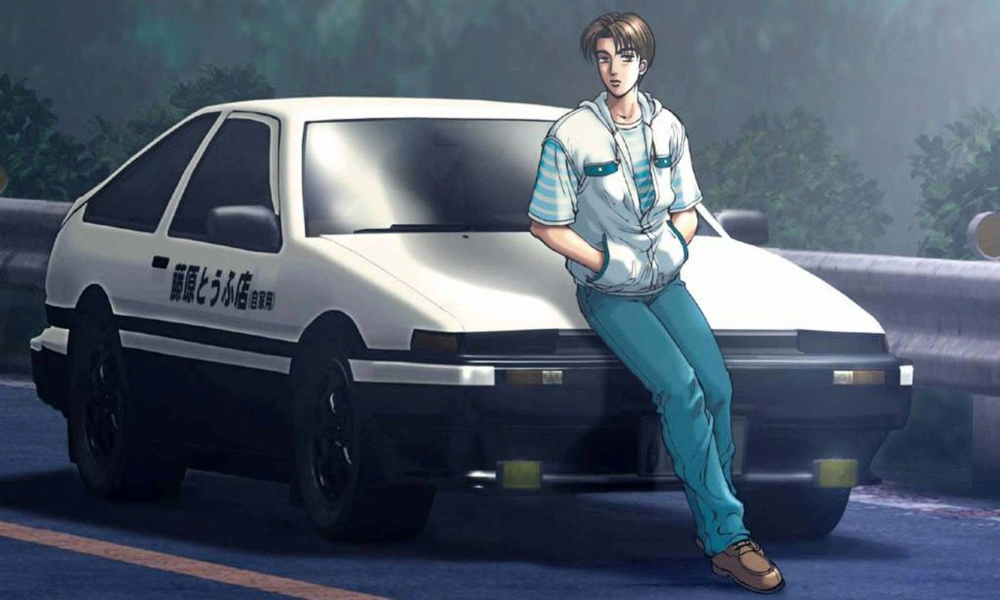

  

My third and final project is called 2D Initial D. I wanted to create something that I was passionate about. So I got some help from a friend to create a racing game based on Initial D. 

The player uses standard wasd controls or the arrow keys to move the car in any direction. The car comes with headlights, drift tires, and you guessed it, missiles. Actual missiles. That wasn't even in the original game. The player must complete the course by a certain amout of time whilst drifting through corners and shooting opponent AI cars out of the way. During the creation of this project, I learned about game states and the ability to move an object through a large object to replicate the idea of a real map. 

Created Spring of 2018, ICS 111.

You can view the game on my [Youtube Channel](https://www.youtube.com/watch?v=pgD2VjapocM).
