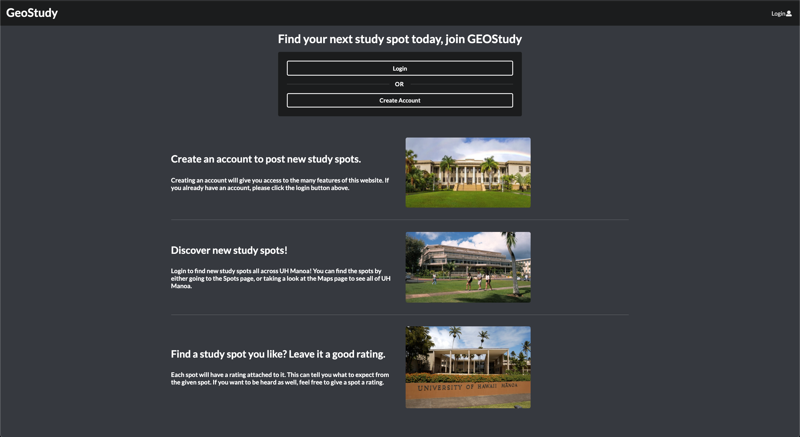

  

# GEOstudy
This team project is called Geostudy. The mission for this project was to use our software development knowledge we learned that semester in order to create a website based on the choice provided by our Professor. For our team, we were tasked with building a website on study spots around UH Manoa campus. 

## Concept

The idea was simple. Incoming students don't know the best places on campus to study. Therefore, allow students with more experience to review and add specific spots on campus. There, other students who come on the site can see what students voted as the best and worst places based on our review system. Sort of like a YELP for study spots. The study spots does not necessarily have to be on campus either, such as cafes and snackbars along University Avenue.

## Experience

This project was my first, "real" project in the realm of computer science and software development. I learned the importantance of deadlines, leadership, and compromise. Deadlines are obviously important, but I learned that milestones and small goals show progression and motivate you to continue working. This project also taught me that leadership is important when working with a team. Democracy takes too much time in a team environment where deadlines are approaching quickly. In my opinion, giving the leadership role to the most experienced coder, and having them finalize a decision when the situation is at a stalemate, really speeds up the process. Lastly, this project has taught me about compromise. You will not have full creative control over the project because there are other people on your team that would like to contribute as much as you. Therefore, it is important to learn on how to compromise.

I had an overall great experience with this project and I hope to do something similar in the future. 

[Link to GEOstudy](https://geostudy.github.io/).
